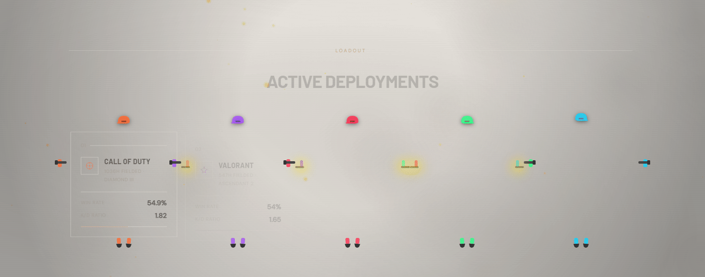
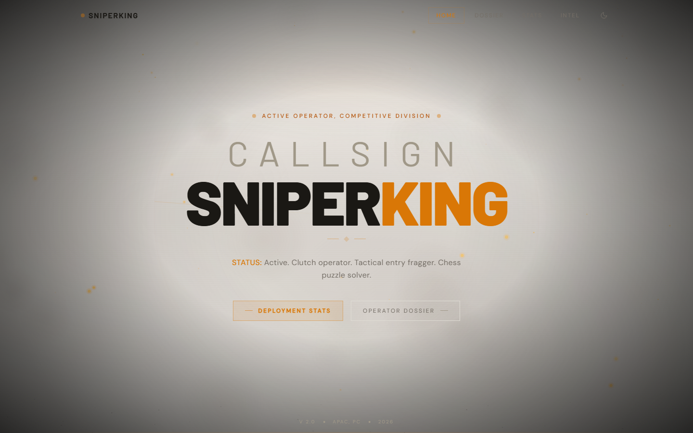
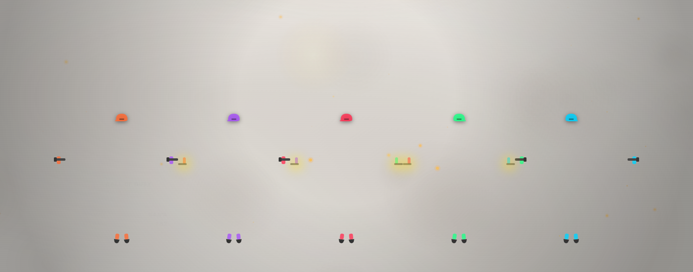
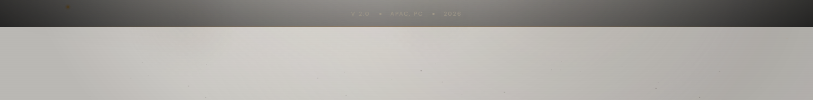
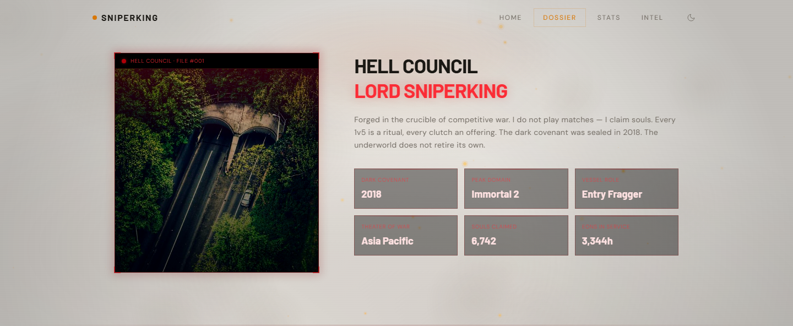

<div align="center">

<br>

<!-- Animated Banner -->


<br><br>

<!-- Title -->
<p style="font-family: 'Barlow', 'Arial Black', sans-serif; font-size: 48px; font-weight: 900; letter-spacing: -0.02em; line-height: 1; margin: 0;">
  <span style="color: #d97706;">SNIPER</span><span style="color: #eee8e0;">KING</span>
</p>

<p style="font-family: 'DM Sans', system-ui, sans-serif; font-size: 13px; letter-spacing: 0.3em; text-transform: uppercase; color: #585050; margin-top: 8px;">
  Active Operator · Competitive Division · APAC Theater
</p>

<br>

<!-- Status Line -->
<div style="display: inline-block; border: 1px solid rgba(217,119,6,0.25); padding: 8px 24px; font-family: 'DM Sans', monospace; font-size: 11px; letter-spacing: 0.2em; text-transform: uppercase; color: #d97706;">
  <span style="display: inline-block; width: 8px; height: 8px; background: #d97706; border-radius: 50%; margin-right: 10px; vertical-align: middle; animation: pulse 2s ease-in-out infinite;"></span>
  STATUS: ACTIVE · 5 THEATERS · IMMORTAL 2
</div>

<br><br>

<!-- Nav Badges -->
<a href="#overview"></a>&nbsp;
<a href="#features"></a>&nbsp;
<a href="#tech"></a>&nbsp;
<a href="#deployments"></a>&nbsp;
<a href="#dossier"></a>

<br><br>

---

</div>

## <a name="overview"></a>🎯 Overview

<p style="font-family: 'DM Sans', system-ui, sans-serif; font-size: 15px; color: #888080; max-width: 700px;">
  A living warzone-themed competitive gaming portfolio. Five game cards transformed into 
  autonomous soldier-boxes that breathe, aim, shoot, jump, and fight each other in real time. 
  Wrapped in a tactical HUD interface with scanlines, radar sweeps, and a dynamic particle-based 
  battlefield background that responds to scroll.
</p>

<br>

<!-- Hero Preview -->
<table>
  <tr>
    <td width="70%" style="border: 1px solid #1a1a1a; padding: 0; border-radius: 4px;">
      
    </td>
    <td width="30%" style="border: 1px solid #1a1a1a; padding: 16px; vertical-align: top; background: #080808;">
      <p style="font-family: 'Barlow', sans-serif; font-weight: 900; font-size: 14px; letter-spacing: 0.15em; text-transform: uppercase; color: #d97706; margin: 0 0 8px 0;">HEADS UP DISPLAY</p>
      <p style="font-family: 'DM Sans', sans-serif; font-size: 11px; color: #585050; margin: 0 0 4px 0; line-height: 1.6;">
        ⚡ Radar sweep animation<br>
        ⚡ Scanline overlay<br>
        ⚡ Live status indicator<br>
        ⚡ HUD corner accents<br>
        ⚡ Amber tactical palette<br>
        ⚡ Dark/light mode toggle<br>
        ⚡ Grid pattern overlay<br>
        ⚡ Vignette depth effect
      </p>
    </td>
  </tr>
</table>

<br>

---

## <a name="features"></a>⚔️ Combat Features

<br>

<!-- Three-column feature grid -->
<table>
  <tr>
    <td width="33%" style="border: 1px solid #1a1a1a; padding: 20px; vertical-align: top; background: #101010;">
      <p style="font-family: 'Barlow', sans-serif; font-weight: 900; font-size: 24px; color: #d97706; margin: 0 0 4px 0;">01</p>
      <p style="font-family: 'Barlow', sans-serif; font-weight: 700; font-size: 14px; letter-spacing: 0.1em; text-transform: uppercase; color: #eee8e0; margin: 0 0 8px 0;">Soldier Boxes</p>
      <p style="font-family: 'DM Sans', sans-serif; font-size: 12px; color: #585050; margin: 0; line-height: 1.7;">
        Each game card is a living soldier with an SVG helmet, 
        arms holding rifles, and marching legs. Autonomous AI 
        loop: shoot, jump, crouch, flinch, patrol — each soldier 
        acts independently with seeded random behavior.
      </p>
    </td>
    <td width="33%" style="border: 1px solid #1a1a1a; padding: 20px; vertical-align: top; background: #101010;">
      <p style="font-family: 'Barlow', sans-serif; font-weight: 900; font-size: 24px; color: #d97706; margin: 0 0 4px 0;">02</p>
      <p style="font-family: 'Barlow', sans-serif; font-weight: 700; font-size: 14px; letter-spacing: 0.1em; text-transform: uppercase; color: #eee8e0; margin: 0 0 8px 0;">War Background</p>
      <p style="font-family: 'DM Sans', sans-serif; font-size: 12px; color: #585050; margin: 0; line-height: 1.7;">
        Full-screen canvas particle system: floating smoke clouds, 
        ember particles, ground debris, and distant muzzle flashes. 
        Scroll-responsive intensity — deeper scroll, heavier battle.
      </p>
    </td>
    <td width="33%" style="border: 1px solid #1a1a1a; padding: 20px; vertical-align: top; background: #101010;">
      <p style="font-family: 'Barlow', sans-serif; font-weight: 900; font-size: 24px; color: #d97706; margin: 0 0 4px 0;">03</p>
      <p style="font-family: 'Barlow', sans-serif; font-weight: 700; font-size: 14px; letter-spacing: 0.1em; text-transform: uppercase; color: #eee8e0; margin: 0 0 8px 0;">Hell Council</p>
      <p style="font-family: 'DM Sans', sans-serif; font-size: 12px; color: #585050; margin: 0; line-height: 1.7;">
        About section redesigned as a Lord of Hell dossier. 
        Solid avatar, hell-fire glow frame, demonic stats 
        (Souls Claimed, Eons in Service), chain corner accents.
      </p>
    </td>
  </tr>
</table>

<br>

<!-- Game Grid Screenshot -->


<br>

---

## <a name="tech"></a>⚙️ Tech Stack

<br>

<p align="center">
  
  
  
  
  
</p>

<br>

<table>
  <tr>
    <td width="25%" style="border: 1px solid #1a1a1a; padding: 16px; vertical-align: top; background: #101010;">
      <p style="font-family: 'Barlow', sans-serif; font-weight: 700; font-size: 11px; letter-spacing: 0.1em; text-transform: uppercase; color: #d97706; margin: 0 0 4px 0;">Frontend</p>
      <p style="font-family: 'DM Sans', sans-serif; font-size: 11px; color: #585050; margin: 0; line-height: 1.7;">
        React 19 · Vite 8 · Tailwind v4 · Framer Motion 12 · React Router 7
      </p>
    </td>
    <td width="25%" style="border: 1px solid #1a1a1a; padding: 16px; vertical-align: top; background: #101010;">
      <p style="font-family: 'Barlow', sans-serif; font-weight: 700; font-size: 11px; letter-spacing: 0.1em; text-transform: uppercase; color: #d97706; margin: 0 0 4px 0;">Fonts</p>
      <p style="font-family: 'DM Sans', sans-serif; font-size: 11px; color: #585050; margin: 0; line-height: 1.7;">
        Barlow (Display) · DM Sans (Body) · Google Fonts CDN
      </p>
    </td>
    <td width="25%" style="border: 1px solid #1a1a1a; padding: 16px; vertical-align: top; background: #101010;">
      <p style="font-family: 'Barlow', sans-serif; font-weight: 700; font-size: 11px; letter-spacing: 0.1em; text-transform: uppercase; color: #d97706; margin: 0 0 4px 0;">Build</p>
      <p style="font-family: 'DM Sans', sans-serif; font-size: 11px; color: #585050; margin: 0; line-height: 1.7;">
        ESBuild minify · Code splitting · CSS custom properties · Dark/light vars
      </p>
    </td>
    <td width="25%" style="border: 1px solid #1a1a1a; padding: 16px; vertical-align: top; background: #101010;">
      <p style="font-family: 'Barlow', sans-serif; font-weight: 700; font-size: 11px; letter-spacing: 0.1em; text-transform: uppercase; color: #d97706; margin: 0 0 4px 0;">Animation</p>
      <p style="font-family: 'DM Sans', sans-serif; font-size: 11px; color: #585050; margin: 0; line-height: 1.7;">
        Framer Motion spring · Canvas particle system · CSS keyframes · SVG morph
      </p>
    </td>
  </tr>
</table>

<br>

---

## <a name="deployments"></a>📊 Career Stats

<br>

<div align="center">

| Theater | Role | Rank | Win Rate | K/D |
|---------|------|------|----------|-----|
| **Call of Duty** | Entry Fragger | Crimson 2 | 64% | 1.85 |
| **Valorant** | Duelist | Immortal 2 | 58% | 1.42 |
| **Free Fire** | Rusher | Heroic | 71% | 2.10 |
| **Among Us** | Crewmate | — | 76% | — |
| **Chess** | Strategist | 1850 ELO | 62% | 1850 |

</div>

<br>

<!-- Stats Bar -->


<br>

---

## <a name="dossier"></a>📁 Operator Dossier

<br>

<table>
  <tr>
    <td width="40%" style="border: 1px solid #1a1a1a; padding: 0; border-radius: 4px;">
      
    </td>
    <td width="60%" style="border: 1px solid #1a1a1a; padding: 20px; vertical-align: top; background: #080808;">
      <p style="font-family: 'Barlow', sans-serif; font-weight: 900; font-size: 16px; letter-spacing: 0.1em; text-transform: uppercase; color: #d97706; margin: 0 0 12px 0;">HELL COUNCIL · FILE 001</p>
      <p style="font-family: 'DM Sans', sans-serif; font-size: 12px; color: #888080; margin: 0 0 16px 0; line-height: 1.7;">
        Forged in the crucible of competitive war. Every 1v5 is a ritual, 
        every clutch an offering. The dark covenant was sealed in 2018.
      </p>
      <table style="width: 100%;">
        <tr>
          <td style="border: 1px solid rgba(220,38,38,0.25); padding: 10px; background: rgba(0,0,0,0.4);">
            <p style="font-family: 'DM Sans', sans-serif; font-size: 9px; letter-spacing: 0.15em; text-transform: uppercase; color: rgba(239,68,68,0.6); margin: 0 0 2px 0;">Souls Claimed</p>
            <p style="font-family: 'Barlow', sans-serif; font-size: 18px; font-weight: 700; color: #fecaca; margin: 0;">450</p>
          </td>
          <td style="border: 1px solid rgba(220,38,38,0.25); padding: 10px; background: rgba(0,0,0,0.4);">
            <p style="font-family: 'DM Sans', sans-serif; font-size: 9px; letter-spacing: 0.15em; text-transform: uppercase; color: rgba(239,68,68,0.6); margin: 0 0 2px 0;">Eons in Service</p>
            <p style="font-family: 'Barlow', sans-serif; font-size: 18px; font-weight: 700; color: #fecaca; margin: 0;">725h</p>
          </td>
        </tr>
      </table>
    </td>
  </tr>
</table>

<br>

---

## 🛠️ Local Development

<br>

```bash
# Clone
git clone https://github.com/shivamsingh-007/GAMING-PROFILE-.git
cd GAMING-PROFILE-

# Install
npm install

# Dev
npm run dev

# Build
npm run build
```

<br>

---

<div align="center">

<br>

<p style="font-family: 'DM Sans', sans-serif; font-size: 11px; letter-spacing: 0.2em; text-transform: uppercase; color: #585050;">
  SNIPERKING · COMPETITIVE GAMING PORTFOLIO · APAC DIVISION
</p>

<p style="font-family: 'DM Sans', sans-serif; font-size: 10px; color: #383838; margin-top: 12px;">
  © 2026 · Built with React + Vite · Dark mode ready · Soldier-box combat system
</p>

<br>

</div>

<style>
@keyframes pulse {
  0%, 100% { opacity: 1; }
  50% { opacity: 0.4; }
}
table { border-collapse: collapse; }
td { padding: 0; }
img { max-width: 100%; }
</style>
